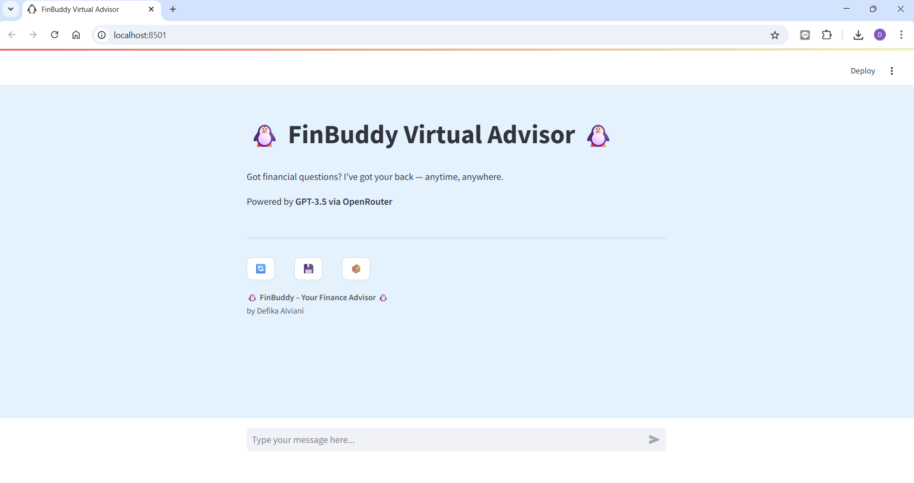
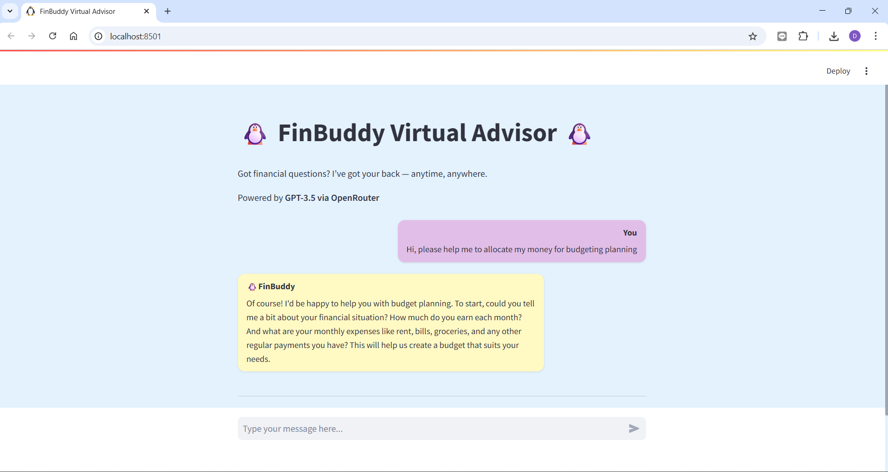
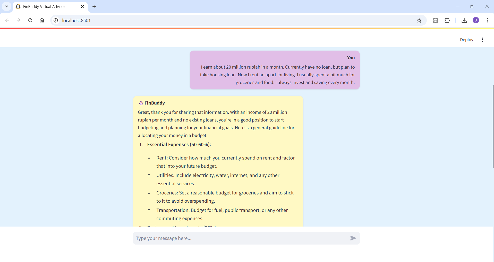

# 🐧 FinBuddy Virtual Advisor Chatbot – Streamlit + OpenRouter 

A simple yet powerful financial chatbot built with **Streamlit**, connected via **OpenRouter** to large language models like `gpt-3.5-turbo`.  
This chatbot mimics a helpful financial advisor from **FinBuddy**, giving clear, personalized guidance in a conversational style.

---

## 🚀 Features

- 💬 Interactive chat interface using Streamlit
- 🔗 API integration with [OpenRouter.ai](https://openrouter.ai)
- 🧠 Powered by `gpt-3.5-turbo` or any model supported by OpenRouter
- 🇮🇩  Designed with focus on Indonesian financial context
- 📂 Lightweight and beginner-friendly

---

## 🛠️ Installation

1. **Clone the repository**

```bash
git clone https://github.com/yourusername/finbuddy-chatbot.git
cd finbuddy-chatbot
```

2. **Create and activate virtual environment**

```bash
python -m venv chatbot_env
chatbot_env\Scripts\activate  # For Windows
# or
source chatbot_env/bin/activate  # For macOS/Linux
```

3. **Install dependencies**

```bash
pip install -r requirements.txt
```

4. **Set your OpenRouter API key**

Open app.py and replace this line with your actual OpenRouter API key:
```bash
OPENROUTER_API_KEY = "your-api-key-here"
```

5. **▶️ Run the App**
```bash
streamlit run app.py
```
The app will open in your browser at:
http://localhost:8501

---

## 📂 Project Structure
```bash
├── app.py              # Main Streamlit app
├── chatbot_env/        # Virtual environment (optional)
├── README.md           # Project documentation
├── requirements.txt    # Python dependencies
├── streamlit_app.py    # streamlit app to be uploaded on streamlit cloud
```
---

## 🧠 Chatbot Role Prompt
> You are a friendly and knowledgeable financial advisor named FinBuddy.
                Your goal is to help users understand and manage their personal finances.
                You provide simple, clear, practical advice on topics like budgeting, saving, debt, investments, loans, and financial planning.
                Always explain things in simple, easy-to-understand language, especially for users who are new to finance.
                Focus on financial practices, habits, and tools that are relevant to users in Indonesia.
                Ask questions about users’ financial situations to offer more personalized advice.
                Offer helpful solutions or referrals when appropriate, but avoid sounding too salesy.
                Be supportive, honest, and never make unrealistic promises.

---

## 📄 License
This project is for educational and non-commercial use only.
All API usage must comply with OpenRouter and model provider terms of service.

---

## 🙌 Credits
- Streamlit
- OpenRouter.ai
- OpenAI GPT models

---

## 📸 Preview

Here's a step-by-step walkthrough of how FinBuddy chatbot works:

### Step 1: Start the chat
User opens the app and sees the welcome screen with a message input field.  
🖼️ `1_start_chat.png`


---

### Step 2: User asks a question and gets a response
The user types a financial question, and FinBuddy gives a helpful AI-powered response.  
🖼️ `2_sample_question_and_response.png`


---

### Step 3: Follow-up response
The conversation continues smoothly with a follow-up question and another accurate response from FinBuddy.  
🖼️ `3_sample_follow_up_response.png`

